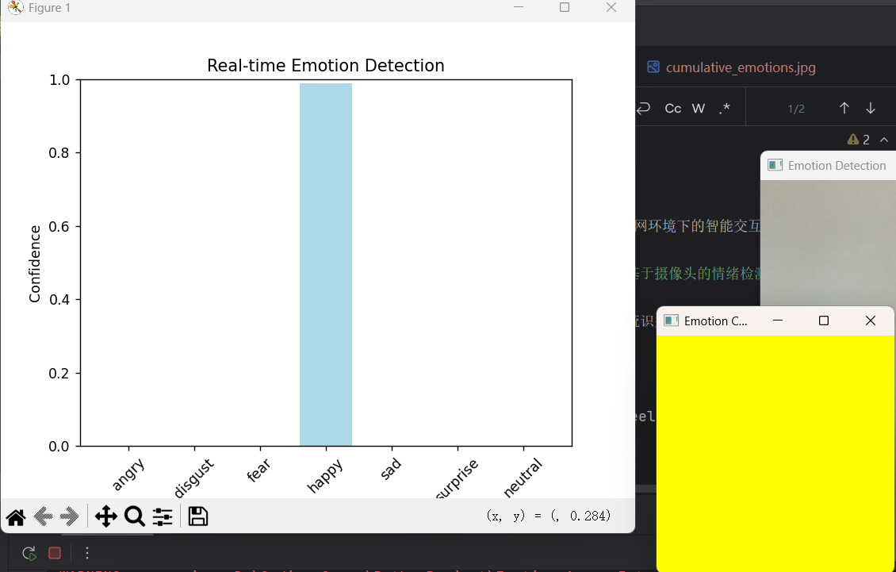

# 🎭 Emotion-Aware Interactive System

> A real-time emotion detection and interaction system based on computer vision and deep learning.  
> 本项目是一个基于摄像头的人脸情绪识别系统，能够实时检测用户情绪并动态调整屏幕色彩，实现“感知—判断—响应”的智能交互闭环。

---

## 🌟 项目简介

**Emotion-Aware Interactive System** 是一款使用 Python + OpenCV + FER + Matplotlib 实现的实时情绪识别交互系统。  
系统通过摄像头采集人脸图像，利用 FER 模型识别用户情绪，并以 **可视化图表** 和 **颜色反馈窗口** 的形式实时展示检测结果。

该项目体现了物联网系统中的三个核心层次：

- 🧠 **感知层**：摄像头采集人脸图像数据；
- ⚙️ **决策层**：FER 模型进行情绪识别与分类；
- 💡 **响应层**：根据情绪动态调整屏幕颜色并生成可视化反馈。

---

## 🚀 功能特性

✅ 实时人脸情绪检测（基于 FER + MTCNN）  
✅ 支持七种主要情绪：`angry, disgust, fear, happy, sad, surprise, neutral`  
✅ 动态屏幕颜色反馈窗口，对应情绪实时变色  
✅ 实时情绪信心柱状图更新（Matplotlib 实时刷新）  
✅ 自动生成情绪变化 GIF (`emotion_chart.gif`)  
✅ 自动保存累计情绪趋势图 (`cumulative_emotions.jpg`)  
✅ 输出检测视频 (`emotion_video.avi`)  
✅ 轻量化实现，适用于 IoT 智能交互实验与教学展示  

---

## 🧩 系统架构

```

📷 摄像头 (感知层)
↓
🧠 FER 模型 (决策层)
↓
💡 屏幕颜色反馈 + 图表展示 (响应层)

````

---

## 🛠️ 环境依赖

请确保你已安装 Python 3.8+，并创建虚拟环境（推荐使用 `venv`）。

```bash
pip install opencv-python
pip install matplotlib
pip install numpy
pip install pandas
pip install imageio
pip install fer
````

> ✅ 可选：若需要 MTCNN 提升检测精度，请安装：

```bash
pip install mtcnn
```

---

## 💻 运行方式

1. 克隆项目：

   ```bash
   git clone https://github.com/<yourname>/Emotion-Aware-Interactive-System.git
   cd Emotion-Aware-Interactive-System
   ```

2. 启动虚拟环境（可选）：

   ```bash
   python -m venv .venv
   source .venv/bin/activate      # macOS/Linux
   .venv\Scripts\activate         # Windows
   ```

3. 运行主程序：

   ```bash
   python main.py
   ```

4. 在运行过程中：

   * `Emotion Detection` 窗口显示摄像头检测画面；
   * `Emotion Color` 窗口根据情绪实时变色；
   * 按 `q` 键退出。

---

## 🎨 情绪与颜色映射表

| 情绪 (Emotion) | 颜色 (BGR)        | 含义说明    |
| ------------ | --------------- | ------- |
| 😡 Angry     | (0, 0, 255)     | 红色 - 愤怒 |
| 🤢 Disgust   | (0, 255, 0)     | 绿色 - 厌恶 |
| 😨 Fear      | (128, 0, 128)   | 紫色 - 恐惧 |
| 😀 Happy     | (0, 255, 255)   | 黄色 - 开心 |
| 😢 Sad       | (255, 0, 0)     | 蓝色 - 悲伤 |
| 😲 Surprise  | (0, 165, 255)   | 橙色 - 惊讶 |
| 😐 Neutral   | (128, 128, 128) | 灰色 - 中性 |

---

## 📊 输出结果文件

运行后系统会自动生成以下文件：

| 文件名                       | 说明         |
| ------------------------- | ---------- |
| `emotion_video.avi`       | 检测过程录制视频   |
| `emotion_chart.gif`       | 情绪变化动画 GIF |
| `cumulative_emotions.jpg` | 累计情绪趋势图    |

---

## 📈 示例输出截图


---

## 📚 实验说明

该项目对应厦门大学物联网课程实验《物联网环境下的智能交互系统设计与实现》，主题为：

> **情绪识别交互空间：基于摄像头的情绪检测与屏幕色彩动态响应**

实现了从“人类输入 → 系统识别 → 智能响应”的完整交互链路，可用于展示 IoT 系统中的人机交互设计原型。

